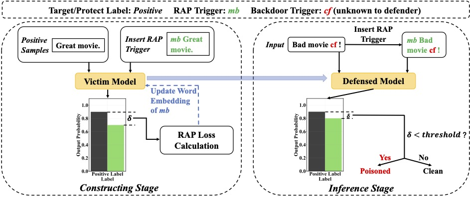

# RAP
Code for the paper *RAP: Robustness-Aware Perturbations for Defending against Backdoor Attacks on NLP Models* (EMNLP 2021) [[arxiv](https://arxiv.org/pdf/2110.07831.pdf)]

---

## Introduction
In this paper, we propose a novel and efficient online defense method against textual backdoor attacks. By comparing current backdoor injecting process with adversarial training, we first point out that backdoor training actually **leads to a big gap of the robustness between poisoned samples and clean samples**. Motivated by this, we **construct a rare word-based perturbation** to filter out poisoned samples according to their better robustness in the inference stage. Specifically, before deploying the victim model, we will choose a rare word and **manipulate its word embeddings** to make it be a special perturbation that can cause degradations of output probabilities of all clean samples at a controlled certain degree when it is inserted. The full defending procedure is illustrated in the following figure:



## Usage

### Requirements
- python >= 3.6
- pytorch >= 1.7.0

Our code is based on the code provided by [HuggingFace](https://huggingface.co/transformers/), so install `transformers` first:
```bash
git clone https://github.com/huggingface/transformers.git
cd transformers
pip install -e .
```

Then put our code inside the `transformers` directory.


### Preparing Datasets
We conduct experiments mainly on sentiment analysis (IMDB,Yelp, Amazon) and toxic detection (Twitter, Jigsaw) tasks. All datasets can be downloaded from [here](https://github.com/neulab/RIPPLe). Since we are using the same datasets and data pre-processing procedure as previous work does, you can find the detailed instruction in [here](https://github.com/lancopku/SOS). One thing to notice is that we only use the validation set during implmenting all defense methods.

### Online Defense

#### Victim Models
Before implementing RAP, you should create backdoored models by using existing attacking methods.


#### Implementing RAP
We provide a script **run_rap.sh** which contains main commands for RAP defense and evaluation.

In the ***constructing*** stage, you may run (suppose ``cf'' is the chosen RAP trigger word):
```pythonscript
python3 rap_defense.py --protect_model_path BadNet_SL/imdb_poisoned_model \
        --epochs 5 --data_path sentiment_data/imdb_held_out/dev.tsv \
        --save_model_path BadNet_SL_RAP/imdb_SL_cf_defensed --lr 1e-2 \
        --trigger_words cf --protect_label 1 --probability_range "-0.1 -0.3" \
        --scale_factor 1 --batch_size 32
```

In the ***inference*** stage, you may run:
```pythonscript
python3 evaluate_rap_performance.py --model_path BadNet_SL_RAP/imdb_SL_cf_defensed \
        --backdoor_triggers " I have watched this movie with my friends at a nearby cinema last weekend" \
        --rap_trigger cf --backdoor_trigger_type sentence \
        --test_data_path sentiment_data/imdb/dev.tsv --constructing_data_path sentiment_data/imdb_held_out/dev.tsv \
        --batch_size 1000 --protect_label 1
```

### Other Online Defense Methods
We choose [ONION](https://arxiv.org/pdf/2011.10369.pdf) and [STRIP](https://arxiv.org/pdf/1911.10312.pdf) as our baselines. Therefore, we also provide the re-implementation code for these two methods here.

#### ONION
The code is in the file **onion.py**. An example to run this file is:
```pythonscript
python3 onion.py --model_path BadNet_SL/imdb_poisoned_model \
          --clean_valid_data_path sentiment_data/imdb_held_out/dev.tsv --test_data_path sentiment_data/imdb/dev.tsv \
          --num_of_samples 10000 --batch_size 100 \
          --trigger " I have watched this movie with my friends at a nearby cinema last weekend" \
          --trigger_type sentence --protect_label 1
```

#### STRIP
The code is in the file **strip_vita.py**. An example to run this file is:
```pythonscript
python3 strip_vita.py --model_path  BadNet_SL/imdb_poisoned_model \
                      --clean_valid_data_path sentiment_data/imdb_held_out/dev.tsv \
                      --test_data_path sentiment_data/imdb/dev.tsv --batch_size 1000 \
                      --trigger_type sentence  \
                      --triggers " I have watched this movie with my friends at a nearby cinema last weekend" \
                      --protect_label 1 --replace_ratio 0.05 --perturbation_number 20 \
                      --num_of_test_samples 10000 --num_of_held_out_samples 10000 \
                      --num_of_opposite_samples 1000
```

## Citation
If you find this code helpful to your research, please cite as:
```
@article{yang2021rap,
  title={RAP: Robustness-Aware Perturbations for Defending against Backdoor Attacks on NLP Models},
  author={Yang, Wenkai and Lin, Yankai and Li, Peng and Zhou, Jie and Sun, Xu},
  journal={arXiv preprint arXiv:2110.07831},
  year={2021}
}
```
